# Weekly Price of Corn Predictor

Regime detection and one-step forecasting for **weekly corn futures prices** using Hidden Markov Models and complementary techniques.

This repository started as a from-scratch educational HMM notebook (price discretization → discrete emissions → heuristic EM). It has been reworked into a **modular research package** with:

- a numerically stable **Baum–Welch discrete HMM**
- **complementary models** (Gaussian HMM, regime-switching AR, return-symbol HMM)
- **holdout evaluation** against strong baselines
- **publication-ready visualizations**
- the original notebook preserved under `notebooks/`

Data source: [Weekly Corn Prices (Kaggle)](https://www.kaggle.com/nickwong64/corn2015-2017) / Quantopian corn futures.

---

## Why HMMs for corn prices?

Weekly agricultural futures are not a single stationary process. They alternate between quieter mean-reverting stretches and higher-volatility moves driven by inventory, weather, and macro shocks. An HMM treats those episodes as **latent regimes** \(z_t\) that emit observable prices or returns \(x_t\):

\[
z_t \sim P(z_t \mid z_{t-1}), \qquad x_t \sim P(x_t \mid z_t)
\]

Learning \(P(z_t \mid z_{t-1})\) and \(P(x_t \mid z_t)\) gives both a **regime timeline** and a **probabilistic one-step forecast**.

---

## Architecture

```text
data/                        # raw weekly series (price + OHLC)
notebooks/                   # original educational HMM notebook
corn_predictor/
  data/                      # loaders, features, time-based splits
  preprocess/                # K-Means / quantile / uniform discretization
  models/
    discrete_hmm.py          # Forward–Backward + Baum–Welch + Viterbi
    hybrid.py                # regime-drift & discrete-return HMMs
    gaussian_hmm.py          # continuous Gaussian / MV Gaussian HMMs
    regime_switching.py      # Markov-switching AR(1)
    baselines.py             # persistence, MA, drift
  evaluation/                # MAE, RMSE, MAPE, directional accuracy
  visualization/             # figures used in this README
  pipeline.py                # end-to-end experiment
scripts/run_experiment.py
tests/
figures/                     # generated plots
```

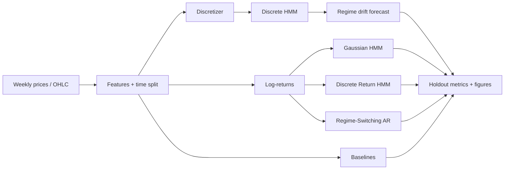

---

## Algorithms

### 1. Discrete HMM (enhanced original idea)

**Idea (from the original notebook):** quantize prices with K-Means into \(M\) symbols, then fit a discrete-emission HMM with \(N\) hidden states.

**What changed:**

| Original notebook | This package |
| --- | --- |
| Heuristic pairwise probability updates | Log-domain **Forward–Backward** + **Baum–Welch** |
| One/two manual EM iterations | Iterates until log-likelihood converges |
| No Viterbi path | Full **Viterbi** decoding |
| Forecast ≈ next cluster center | Optional legacy mode; preferred: **regime + drift** |

Cluster-center decoding is a poor price forecast (quantization error dominates). The recommended discrete variant is **Discrete HMM + Drift**: detect the next regime, then apply that regime’s empirical mean log-return to the last price.

### 2. Discrete Return HMM (complementary)

Same discrete HMM machinery, but symbols are **quantized log-returns** (quantile bins). The next-step forecast uses the expected return under the predictive emission distribution:

\[
\mathbb{E}[r_{t+1}] = \pi_{t+1}^\top B \, c
\]

where \(c\) are bin centers. This keeps the “discrete observation” spirit while targeting the quantity that actually moves prices.

### 3. Gaussian HMM (complementary)

Models continuous log-returns with state-dependent Gaussians (via `hmmlearn`). No discretization step. A multivariate version uses \([\Delta \log p_t,\, |\Delta \log p_t|]\) so regimes can separate calm vs volatile weeks.

### 4. Regime-switching AR(1) (complementary)

Hard-EM / Viterbi alternation for a two-regime AR(1) on returns:

\[
r_t = c_{z_t} + \phi_{z_t} r_{t-1} + \varepsilon_t, \quad \varepsilon_t \sim \mathcal{N}(0, \sigma_{z_t}^2)
\]

Useful when you want **interpretable autoregressive dynamics inside each regime**.

### 5. Baselines

- **Persistence:** \(\hat p_{t+1} = p_t\)
- **Moving average:** trailing 4-week mean
- **Drift:** random walk with mean historical log-return

Weekly commodity series are close to a random walk, so beating persistence on RMSE is genuinely hard — directional accuracy matters at least as much.

---

## Quick start

```bash
pip install -r requirements.txt
# or: pip install -e .

python scripts/run_experiment.py
python -m pytest -q
```

Programmatic API:

```python
from corn_predictor.data import load_prices, train_test_split_time
from corn_predictor.models import DiscreteHMMRegimeDrift, GaussianReturnHMM

df = load_prices("corn2013-2017.txt")
train, test = train_test_split_time(df, test_ratio=0.25)

model = DiscreteHMMRegimeDrift(n_states=2, n_symbols=5)
model.fit(train["price"].to_numpy())
print(model.predict_next(train["price"].to_numpy()))

g = GaussianReturnHMM(n_states=3).fit(train["price"].to_numpy())
print(g.predict_next(train["price"].to_numpy()))
```

---

## Results (25% chronological holdout)

Reproduced by `python scripts/run_experiment.py` on `corn2013-2017.txt`:

| Model | MAE | RMSE | MAPE % | Directional acc. |
| --- | ---: | ---: | ---: | ---: |
| Gaussian HMM | 0.058 | 0.073 | 1.51 | 0.58 |
| Persistence | 0.059 | 0.073 | 1.53 | 0.00* |
| Drift | 0.059 | 0.073 | 1.52 | 0.58 |
| Discrete HMM + Drift | 0.059 | 0.074 | 1.54 | 0.58 |
| Regime-Switching AR | 0.060 | 0.076 | 1.56 | 0.50 |
| MV Gaussian HMM | 0.060 | 0.077 | 1.56 | 0.47 |
| Discrete Return HMM | 0.062 | 0.080 | 1.62 | 0.44 |
| Moving Average | 0.075 | 0.096 | 1.96 | 0.53 |
| Discrete HMM (centers) | 0.576 | 0.592 | 15.13 | 0.42 |

\*Persistence always predicts “no change”, so directional accuracy against non-flat weeks is defined as 0.

**Takeaways**

1. The original center-decoding forecast is not competitive — the architecture keeps it only as an educational baseline.
2. **Discrete HMM + Drift** recovers the original regime story while matching near-persistence RMSE and useful directionality.
3. **Gaussian HMM on returns** is the strongest single model on this sample.
4. Regime models shine more for **interpretation** (colored regime timelines) than for large RMSE gains on a near-random-walk series.

---

## Visualizations

### Price series

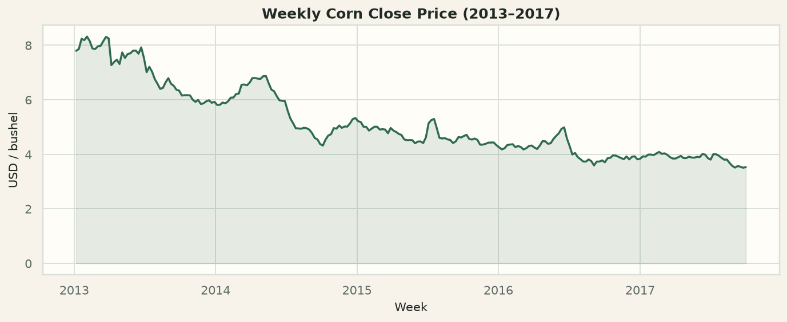

### Discrete HMM regimes

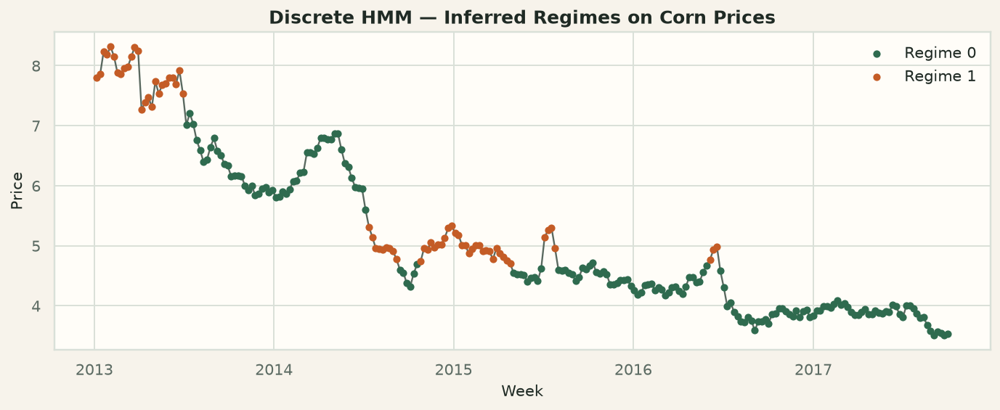

### Learned discrete HMM parameters

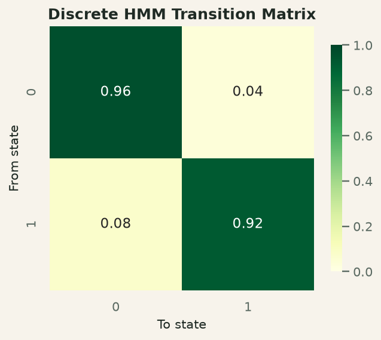

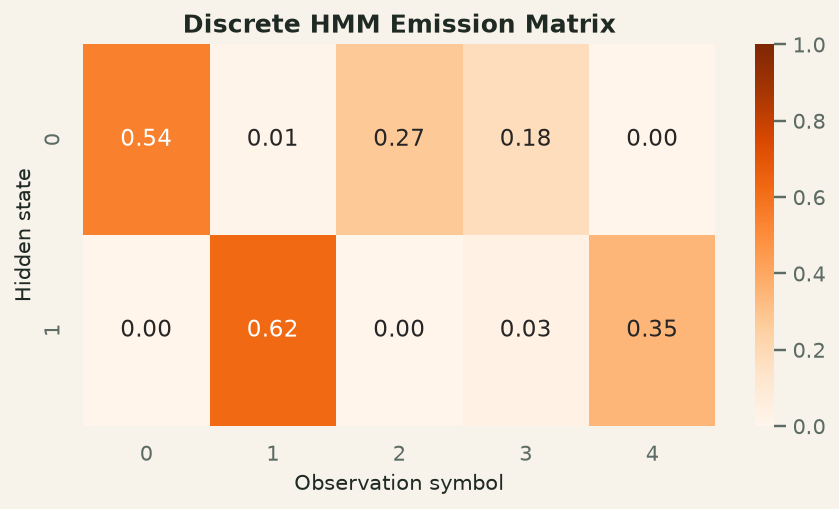

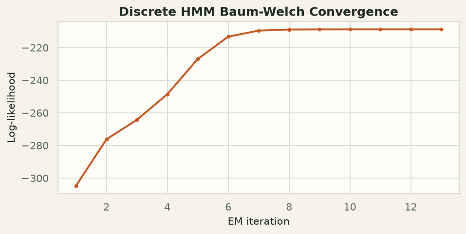

### Gaussian HMM regimes

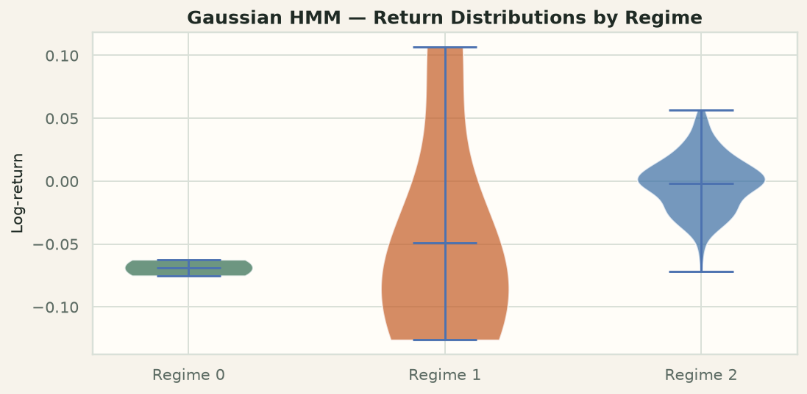

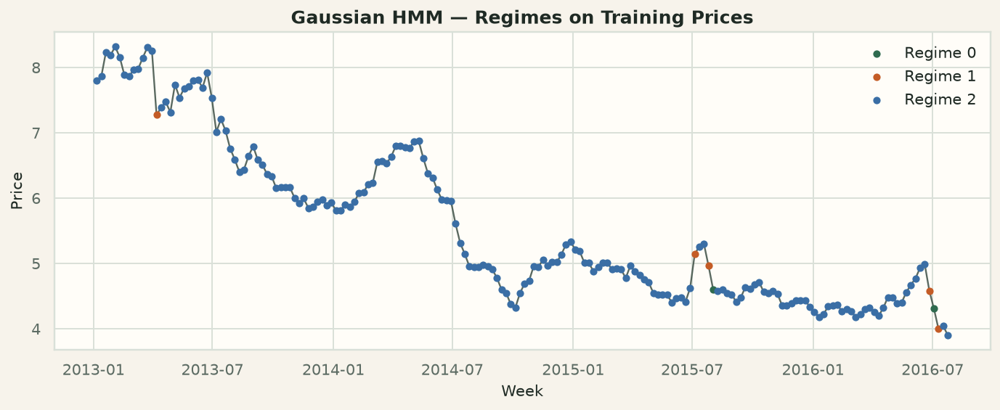

### Forecast comparison

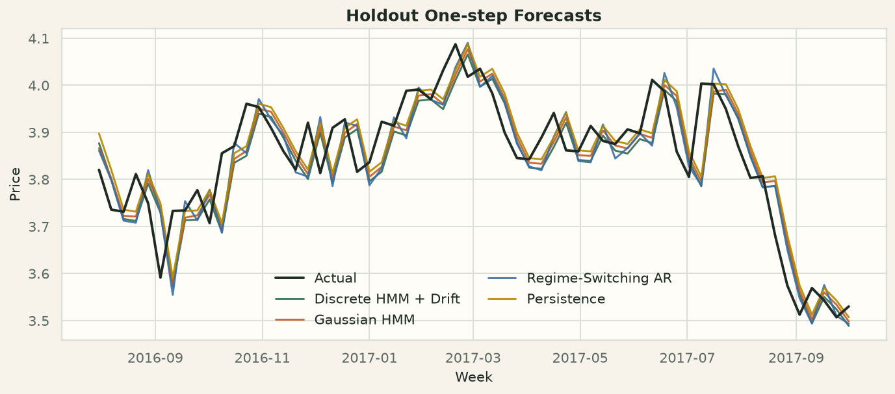

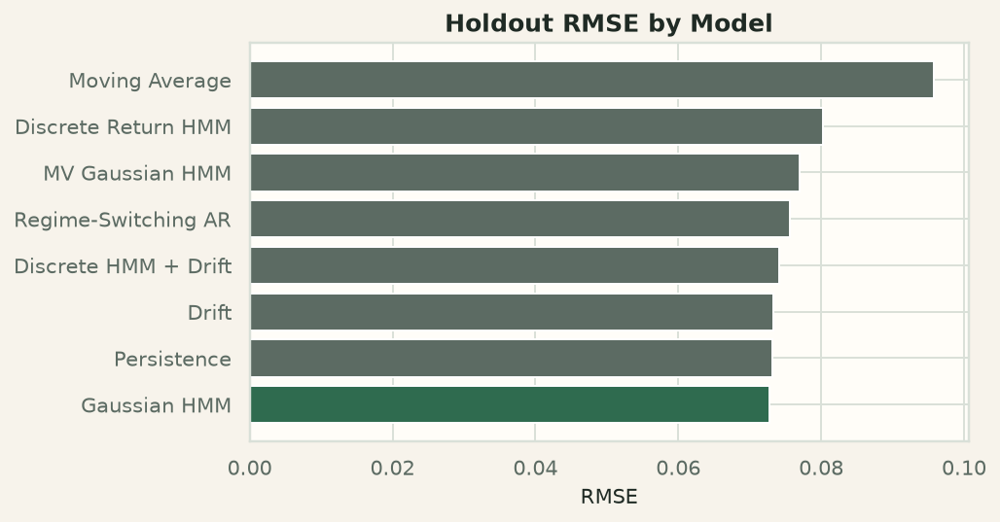

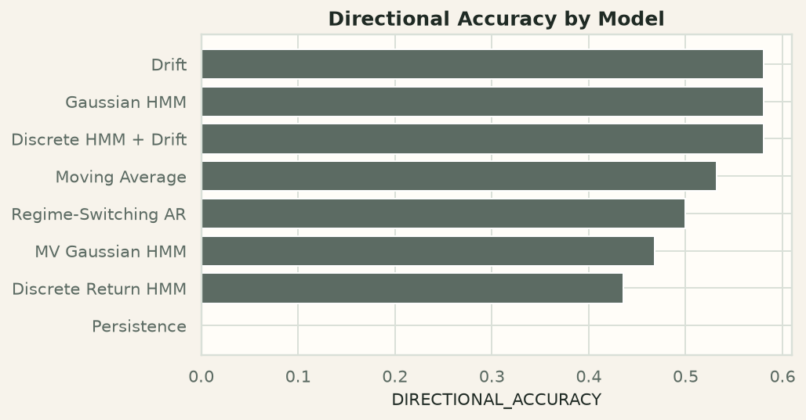

---

## Data files

| File | Contents |
| --- | --- |
| `data/corn2013-2017.txt` | Weekly close prices (2013–2017) |
| `data/corn2015-2017.txt` | Shorter close-price subset |
| `data/corn_OHLC2013-2017.txt` | Weekly open / high / low / close |

Loaders live in `corn_predictor.data` and also derive log-returns, mid, and range features from OHLC.

---

## Original notebook

The educational notebook that implemented the first discrete HMM prototype is unchanged at:

`notebooks/Hidden Markov Models.ipynb`

Use it to see the original dictionary-based parameterizations and manual EM updates. Prefer `corn_predictor` for experiments, evaluation, and figures.

---

## Tests

```bash
python -m pytest -q
```

Covers data loading, chronological splits, ordered discretization, Baum–Welch monotonicity, and smoke tests for persistence / regime-switching models.

---

## Project status / ideas to extend

- Walk-forward refitting (`evaluation.walk_forward_predict`) for stricter backtests
- Bayesian HMM / sticky-HDP priors for automatic regime counts
- Exogenous drivers (USD, oil, USDA reports) inside the emission model
- Trading / hedging policy conditioned on decoded regimes (research only; not financial advice)

---

## License / disclaimer

Personal research code. Futures markets are risky; nothing here is investment advice.
