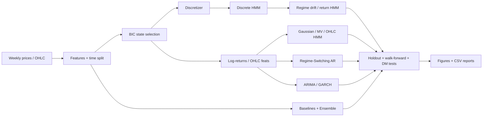

# Weekly Price of Corn Predictor

Regime detection and one-step forecasting for **weekly corn futures prices** using Hidden Markov Models and complementary techniques.

This repository started as a from-scratch educational HMM notebook (price discretization → discrete emissions → heuristic EM). It is now a **modular research package** with proper EM inference, classical baselines, OHLC features, statistical tests, walk-forward validation, and a full figure/report suite.

Data source: [Weekly Corn Prices (Kaggle)](https://www.kaggle.com/nickwong64/corn2015-2017) / Quantopian corn futures.

---

## Why HMMs for corn prices?

Weekly agricultural futures are not a single stationary process. They alternate between quieter mean-reverting stretches and higher-volatility moves driven by inventory, weather, and macro shocks. An HMM treats those episodes as **latent regimes** \(z_t\) that emit observable prices or returns \(x_t\):

\[
z_t \sim P(z_t \mid z_{t-1}), \qquad x_t \sim P(x_t \mid z_t)
\]

Learning those distributions gives both a **regime timeline** and a **probabilistic one-step forecast**.

---

## Architecture

```text
data/                        # raw weekly series (price + OHLC)
notebooks/                   # original educational HMM notebook
corn_predictor/
  data/                      # loaders, features, time-based splits
  preprocess/                # K-Means / quantile / uniform discretization
  models/
    discrete_hmm.py          # Forward–Backward + Baum–Welch + Viterbi
    hybrid.py                # regime-drift & discrete-return HMMs
    gaussian_hmm.py          # continuous Gaussian / MV Gaussian HMMs
    regime_switching.py      # Markov-switching AR(1)
    classical.py             # ARIMA, GARCH, OHLC HMM, ensemble
    baselines.py             # persistence, MA, drift
  evaluation/                # metrics, BIC selection, DM test, regime stats
  visualization/             # figures used in this README
  pipeline.py                # end-to-end experiment
scripts/run_experiment.py
tests/
figures/                     # generated plots
reports/                     # CSV metrics, forecasts, regime tables
.github/workflows/ci.yml     # pytest + smoke experiment
```



---

## Model zoo

| Family | Model | Role |
| --- | --- | --- |
| Original idea (fixed) | Discrete HMM + Baum–Welch | Regime detection on quantized prices |
| Enhanced original | Discrete HMM + Drift | Regime-conditioned return forecast |
| Complementary HMM | Discrete Return HMM | Quantized log-returns |
| Complementary HMM | Gaussian / MV Gaussian HMM | Continuous emissions on returns |
| Complementary HMM | OHLC Gaussian HMM | Uses open/high/low/close features |
| Complementary RS | Regime-switching AR(1) | Interpretable AR dynamics per regime |
| Classical | ARIMA(1,1,1), GARCH(1,1) | Standard time-series baselines |
| Meta | Equal-weight ensemble | Blend Gaussian HMM + discrete drift + drift |
| Naive | Persistence / MA / Drift | Sanity checks |

**Important:** forecasting the next **cluster center** (legacy notebook idea) is kept only as an educational baseline — quantization error makes it unusable for price RMSE.

---

## Quick start

```bash
pip install -r requirements.txt
# or: pip install -e .

python scripts/run_experiment.py
python -m pytest -q
```

Skip the slower walk-forward block:

```bash
python scripts/run_experiment.py --skip-walk-forward
```

Programmatic API:

```python
from corn_predictor.data import load_prices, train_test_split_time
from corn_predictor.models import DiscreteHMMRegimeDrift, GaussianReturnHMM, OHLCGaussianHMM
from corn_predictor.evaluation import select_gaussian_states, summarize_regimes

df = load_prices("corn2013-2017.txt")
train, test = train_test_split_time(df, test_ratio=0.25)
prices = train["price"].to_numpy()

print(select_gaussian_states(prices))

model = GaussianReturnHMM(n_states=2).fit(prices)
print(model.predict_next(prices))
```

---

## Validation stack

1. **BIC state selection** on the training window (discrete & Gaussian HMMs)
2. **Chronological holdout** (last 25%) with MAE / RMSE / MAPE / directional accuracy
3. **Diebold–Mariano** tests vs persistence (squared-error loss)
4. **Walk-forward** expanding-window backtest with periodic refits
5. **Regime analytics** — occupancy, mean/max duration, return moments
6. **CSV reports** under `reports/` for every table above

---

## Results (reproducible)

From `python scripts/run_experiment.py` on `corn2013-2017.txt`:

**BIC-selected states:** discrete HMM → **3**, Gaussian HMM → **2**

| Model | MAE | RMSE | MAPE % | Dir. acc. |
| --- | ---: | ---: | ---: | ---: |
| Gaussian HMM | 0.058 | 0.073 | 1.51 | 0.58 |
| Persistence | 0.059 | 0.073 | 1.53 | 0.00* |
| OHLC Gaussian HMM | 0.058 | 0.073 | 1.51 | **0.60** |
| Drift | 0.059 | 0.073 | 1.52 | 0.58 |
| Ensemble | 0.059 | 0.073 | 1.52 | 0.58 |
| GARCH | 0.059 | 0.074 | 1.53 | 0.58 |
| Discrete HMM + Drift | 0.059 | 0.074 | 1.54 | 0.58 |
| Regime-Switching AR | 0.060 | 0.076 | 1.56 | 0.50 |
| ARIMA | 0.062 | 0.076 | 1.61 | 0.45 |
| Discrete HMM (centers) | 0.576 | 0.592 | 15.13 | 0.42 |

\*Persistence predicts flat prices, so directional accuracy is 0 by definition.

**Takeaways**

- Weekly corn is close to a random walk: RMSE gains vs persistence are small; **directional accuracy** and **regime interpretation** are the interesting outputs.
- **OHLC Gaussian HMM** posts the best directional accuracy on this sample.
- DM tests do **not** find significant RMSE improvement vs persistence for the competitive models (as expected on a near-martingale series). The legacy center decoder is significantly *worse*.
- Discrete HMM regimes separate a long low-price occupancy state from shorter elevated / volatile spells (see regime summary CSVs).

---

## Visualizations

### Price series & regimes


### Learned discrete HMM


### Gaussian regimes


### Forecasts & metrics


### Model selection, durations, DM, walk-forward


---

## Data files

| File | Contents |
| --- | --- |
| `data/corn2013-2017.txt` | Weekly close prices (2013–2017) |
| `data/corn2015-2017.txt` | Shorter close-price subset |
| `data/corn_OHLC2013-2017.txt` | Weekly open / high / low / close |

---

## Original notebook

Educational prototype (dictionary parameters, manual EM):

`notebooks/Hidden Markov Models.ipynb`

Prefer `corn_predictor` + `scripts/run_experiment.py` for experiments.

---

## Tests & CI

```bash
python -m pytest -q
```

GitHub Actions runs pytest and a smoke experiment on every push/PR (`.github/workflows/ci.yml`).

---

## Further extensions (not implemented)

These would be natural next upgrades if you keep investing in the repo:

| Idea | Why |
| --- | --- |
| Sticky-HDP / Bayesian nonparametrics | Infer the number of regimes instead of BIC grid search |
| Exogenous emissions (USD, oil, USDA reports) | Corn is driven by macro/agri news, not only own lag |
| Predictive intervals / PIT calibration | Quantify uncertainty, not only point RMSE |
| Soft EM for regime-switching AR | Replace hard Viterbi assignment |
| Position/hedging policy simulator | Map regimes → simple long/flat rules (research only) |
| Live data connector | Refresh series beyond 2017 |
| Streamlit / dashboard | Interactive regime explorer for portfolio demos |

---

## License / disclaimer

Personal research code. Futures markets are risky; nothing here is investment advice.
